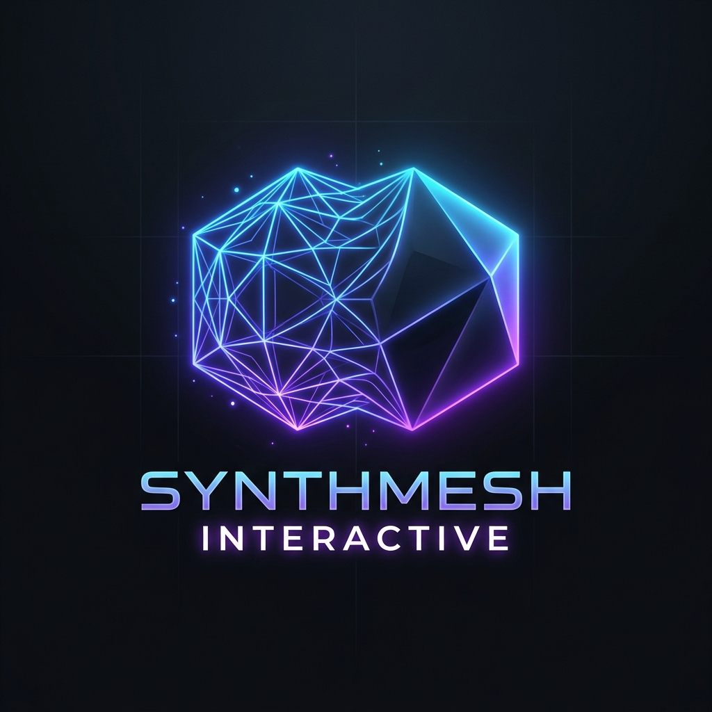
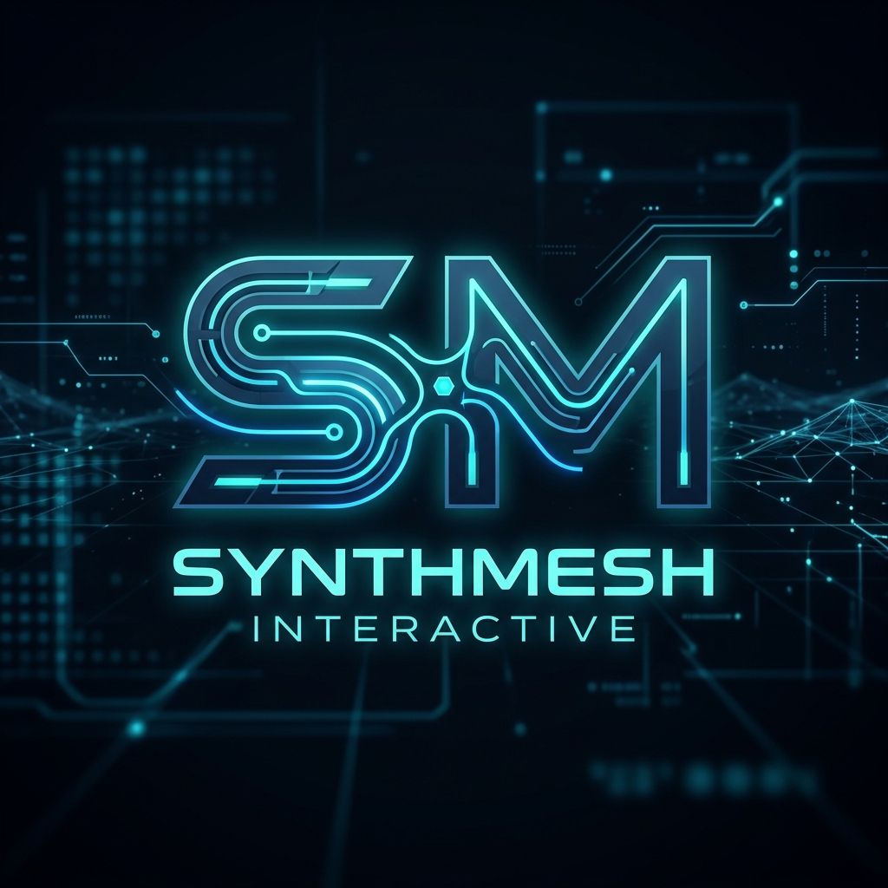

# SynthMesh Interactive: Brand Guidelines

## 1. Studio Name Options

During our branding sprint, we explored names that reflect our tech-forward, frictionless identity and AI-driven capabilities. Here are the top three contenders:

1.  **SynthMesh Interactive (Selected)**: Evokes the blending of AI synthesis and polygon meshes (our CAD-to-Mesh pipeline), while highlighting our highly connected networking infrastructure.
2.  **OmniSync Games**: Focuses on our zero-friction WebRTC networking and unified Supabase cross-progression, suggesting play from anywhere, seamlessly synchronized.
3.  **EdgeFlow Studios**: Highlights our Cloudflare Edge serverless matchmaking and the frictionless "flow state" we provide to players.

## 2. Mission Statement

*To pioneer the next generation of seamless, instantly accessible multiplayer experiences by uniting cutting-edge AI generation with zero-latency edge networking.*

## 3. Tone of Voice

Our communication should reflect our underlying technology:
*   **Precision & Clarity:** No unnecessary fluff. We speak directly to the value of our tech.
*   **Forward-Looking:** We are always pointing to what's next.
*   **Frictionless:** Our language is approachable and straightforward, matching our user experience. 

## 4. Core Aesthetic

**Hyper-Modern / Neon Sci-Fi**
Our visual identity is rooted in the "tech-forward" approach. 
*   **Colors:** Deep blacks, obsidian grays, contrasted with stark, glowing neon accents (cyan, magenta, electric blue).
*   **Shapes:** Clean geometric lines, transforming wireframes, and smooth, solid surfaces that represent our AI CAD-to-Mesh capabilities.
*   **Typography:** Sleek, sans-serif fonts with distinct technological edges. High legibility but modern.

## 5. Concept Logos

Here are two initial logo concepts for **SynthMesh Interactive**:

### Concept 1: The Transformative Wireframe
This logo features a glowing neon blue and purple polygon wireframe mesh transforming into a solid, sleek object, directly representing our AI-driven CAD-to-Mesh pipelines.

### Concept 2: The Connected Typemark
A typography-based logo where the letters S and M are connected by a seamless, glowing cyan circuit-like line, emphasizing our zero-friction WebRTC networking and Cloudflare Edge matchmaking.

