# Tachyon // Studio Brand & Visual Identity Guidelines
**Official Brand Specification & Asset Registry**

---

## 1. Studio Identity & Core Essence

**Studio Name:** Tachyon (Tachyon Studios / Tachyon Interactive)  
**Meaning:** Named after hypothetical particles that travel faster than light. Reflects our core technical pillars: sub-3ms local latency, zero-friction WebRTC P2P networking, serverless edge computing on Cloudflare, and instant browser-to-dogfight onboarding.

### Mission Statement
> *"To pioneer the next generation of seamless, instantly accessible multiplayer experiences by uniting cutting-edge AI generation with zero-latency edge networking and open-source engines."*

---

## 2. Mandatory File Format & Transparency Policy

> [!IMPORTANT]
> **Studio Asset Rule: Always Work in Transparent Formats (SVG / PNG)**
> All official brand marks, HUD icons, badges, UI elements, and concept logos must be authored strictly in transparent vector formats (**SVG**) or transparent 32-bit RGBA raster formats (**PNG**). 
> - **Never** export studio logos or UI assets with opaque white or black JPEG background boxes.
> - SVGs must scale cleanly across any device viewport without raster pixelation.

---

## 3. Official Studio Brand Assets

All vector and raster assets are stored in [`docs/assets/`](file:///c:/Users/Boris/Documents/antigravity/game-studio/studio-monorepo/docs/assets/):

### 3.1 The Tachyon Hero Banner
Used for repository headers, documentation, website hero backdrops, and press materials. Features perspective speed lines, tachyon accelerators, and glowing telemetry.

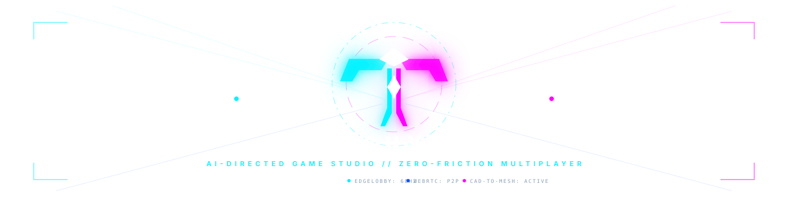
*Format: Vector SVG (`docs/assets/tachyon_banner.svg`) | Transparency: 100% Transparent Viewport*

---

### 3.2 The Primary Tachyon Emblem (Mark)
The geometric "T" emblem. Represents aerodynamic swept wings, dual vertical particle accelerators, and a central fusion diamond.

  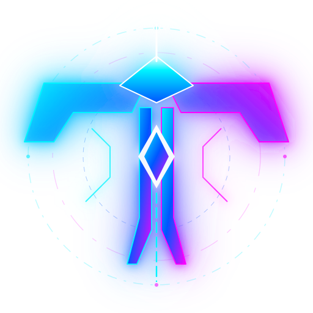

*Formats available:*
- Vector: [`docs/assets/tachyon_mark.svg`](./assets/tachyon_mark.svg)
- High-Res RGBA PNG: [`docs/assets/tachyon_mark.png`](./assets/tachyon_mark.png)

---

### 3.3 The Full Horizontal Logo Lockup
Used for web navigation headers, investor pitch decks, and title cards. Combines the glowing Tachyon mark with custom geometric logotype.

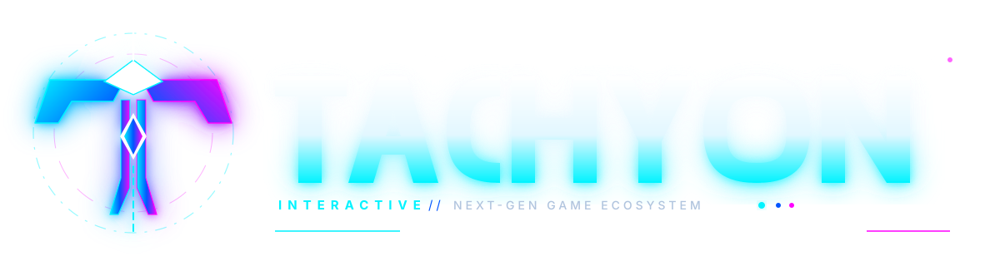

*Formats available:*
- Vector: [`docs/assets/tachyon_logo_full.svg`](./assets/tachyon_logo_full.svg)
- High-Res RGBA PNG: [`docs/assets/tachyon_logo_full.png`](./assets/tachyon_logo_full.png)

---

### 3.4 Ecosystem Category Badges
Transparent hexagonal badges representing our 3 unified game platforms:

| Platform | Badge Asset | Technology Stack | Monetization Strategy |
| :--- | :---: | :--- | :--- |
| **Web F2P** | 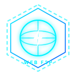 | Three.js / Godot WebGL / WebRTC P2P | Zero-Install, Daily Drops, Idle Card Packs |
| **Mobile F2P** | 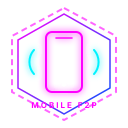 | Godot 4 Mobile / Gyro HOTAS Fusion | Gacha Chests, Skins, Hard Currency Diamonds |
| **AAA Premium** | 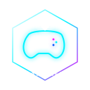 | Unreal Engine 5 (Nanite & Lumen) | $29.99 Base + Founder Cross-Game Status |

---

## 4. Color Palette Specifications: "Separate Identities, United Ecosystem"

Our titles share a common dark matter substrate so they feel interconnected across the Tachyon universe, while each maintaining a distinctive signature accent palette for instant brand recognition:

### 4.1 The Shared Studio Anchor (The Unity)
Every game in the Tachyon ecosystem shares this dark-canvas substrate:
*   **Void Obsidian (`#0B0D11` / `#121212`):** Primary canvas, zero-light space backdrop.
*   **HUD Framework Slate (`#1E293B` / `#334155`):** Structural borders, telemetry dividers, grid lines.
*   **Fusion White (`#FFFFFF`):** Ball core, reticle focal center, high-contrast critical warnings.

### 4.2 Title-Specific Color Signatures (The Separation)

#### 🌐 Title 1: Astro-Smash: Arena (Web F2P)
*Aesthetic: Holographic Sports, Aerodynamic Airflow, High-Velocity Velocity Lines*
*   **Primary Signature:** **Aero Cyan (`#00F3FF`)** — Dynamic Magnus curve trails, goal vortexes.
*   **Secondary Accent:** **Velocity Mint (`#00FFB2`)** — Stamina meters, boost pads, positive score feedback.
*   **Tertiary Accent:** **Deep Ion Blue (`#0055FF`)** — Stadium perimeter barriers, defensive zones.

#### 📱 Title 2: Orbit Runner: Gyro Dash (Mobile F2P)
*Aesthetic: Kinetic Reflex, Cybernetic Arcade, Vertical Overdrive*
*   **Primary Signature:** **Pulse Magenta (`#FF00FF` / `#FF007F`)** — Mobile ship hull trims, speed barriers.
*   **Secondary Accent:** **Ultraviolet (`#9D00FF`)** — Gyro sensor tilt arcs, dangerous cosmic debris.
*   **Tertiary Accent:** **Neon Coral (`#FF3366`)** — Near-miss multipliers, haptic vibration warnings.

#### 💻 Title 3: Vanguard: The Outer War (AAA Premium)
*Aesthetic: Hard-Surface Military Aerospace, Deep Space Naval Tactical, Founder Prestige*
*   **Primary Signature:** **Tactical Cobalt (`#0055FF` / `#1A66FF`)** — Interceptor engine exhausts, shield deflectors.
*   **Secondary Accent:** **Solar Amber Gold (`#FFB800` / `#FFA000`)** — LCOS missile lock pips, Founder badges.
*   **Tertiary Accent:** **Titanium Ice (`#D0E4FF`)** — Cockpit structural frames, CAD hull panel highlights.

## 5. Typography

- **Display & Headlines:** Sleek, high-tech sans-serif with wide letter-spacing (`Inter`, `Segoe UI`, `SF Pro Display`).
- **Telemetry & Technical HUD:** Precision monospaced fonts (`JetBrains Mono`, `ui-monospace`, `SFMono-Regular`).

## 6. High-Res Branding Assets (Strictly Transparent - Zero Grid Policy)

All assets comply strictly with Section 4 of `AGENTS.md`: authored in transparent vector (`.svg`) or 32-bit RGBA (`.png`) with zero background grid or bounding box.

### 6.1 Tachyon Full Vector Brandmark (Primary Web & Print)
- **Vector SVG:** `docs/assets/tachyon_logo_full.svg`
- **Transparent PNG:** `docs/assets/tachyon_logo_full.png`

### 6.2 Tachyon High-Res Emblem Icon
- **Vector SVG:** `docs/assets/tachyon_mark.svg`
- **Transparent PNG:** `docs/assets/tachyon_logo_highres.png`

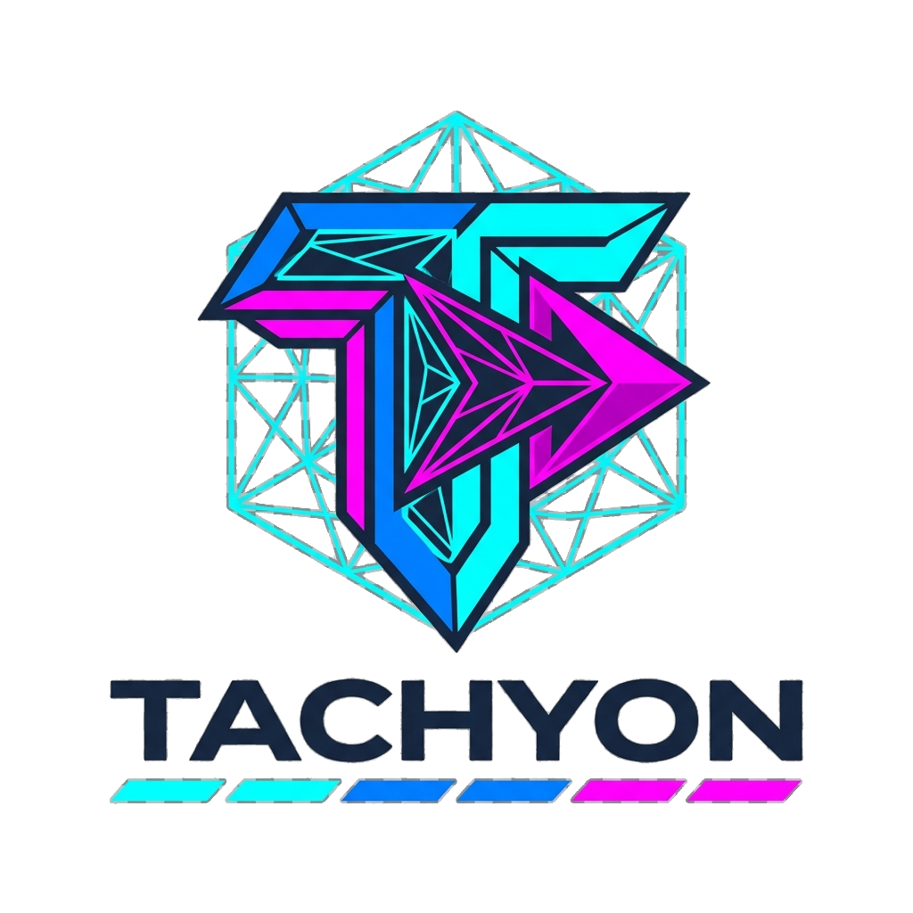

### 6.3 Website Branding Hero Lockup
- **Vector SVG Banner:** `docs/assets/tachyon_banner.svg`
- **Transparent PNG:** `docs/assets/tachyon_website_branding.png`

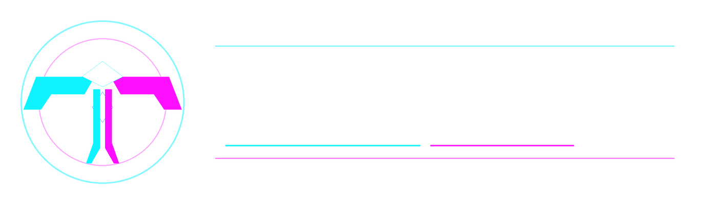

### 6.4 Concept Art & Gameplay Silhouette Assets
- **Tachyon Fighter Interceptor:** [`docs/assets/tachyon_fighter_concept.svg`](./assets/tachyon_fighter_concept.svg) | [`docs/assets/tachyon_fighter_concept.png`](./assets/tachyon_fighter_concept.png)
- **Tachyon Combat Sentry Drone:** [`docs/assets/tachyon_drone_concept.svg`](./assets/tachyon_drone_concept.svg) | [`docs/assets/tachyon_drone_concept.png`](./assets/tachyon_drone_concept.png)
- **Tachyon Magnus Core Ball:** [`docs/assets/tachyon_ball_concept.svg`](./assets/tachyon_ball_concept.svg) | [`docs/assets/tachyon_ball_concept.png`](./assets/tachyon_ball_concept.png)
- **Cybernetic Zero-G Arena:** [`docs/assets/tachyon_concept_arena.png`](./assets/tachyon_concept_arena.png)

  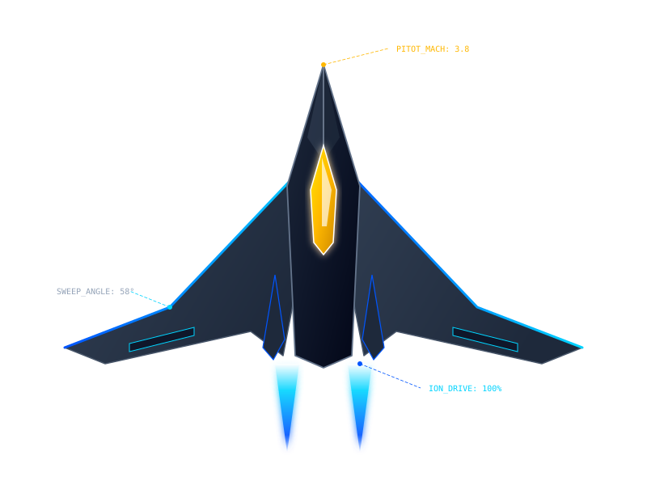
  &nbsp;&nbsp;&nbsp;&nbsp;
  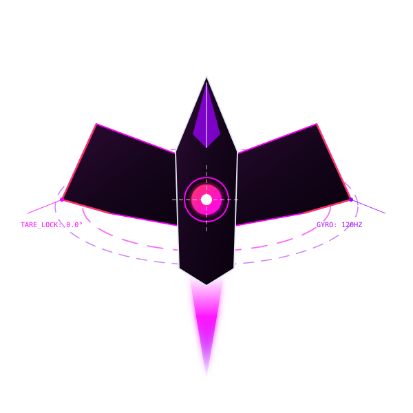
  &nbsp;&nbsp;&nbsp;&nbsp;
  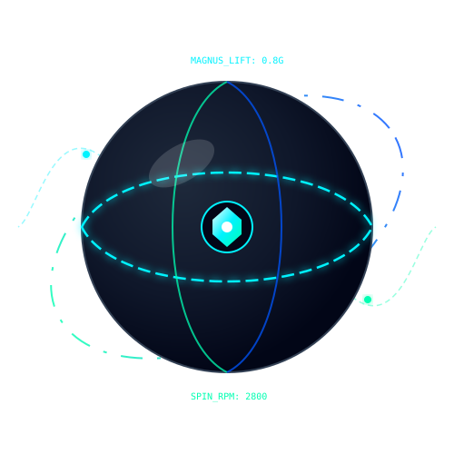

