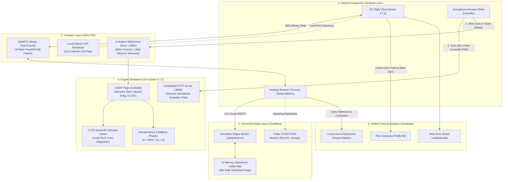

# Tachyon Studios // Technical Architecture Blueprint
**System Specification: Zero-Friction Edge Networking & Cross-Platform Game Pipeline**

---

## 1. System Topology Overview

The Tachyon game ecosystem eliminates dedicated game server fleet costs ($0/month operating cost) by distributing high-frequency physics to client edges via WebRTC DataChannels, while utilizing serverless edge workers for presence and matchmaking.



---

## 2. The 16-Byte Packed Binary Protocol (`@studio/shared-network`)

To avoid Garbage Collection (GC) pauses during 60Hz gameplay, data packets do not use JSON. All transforms, inputs, and commands are packed into a reusable 16-byte buffer (`ArrayBuffer(16)`):

```
 0                   1                   2                   3
 0 1 2 3 4 5 6 7 8 9 0 1 2 3 4 5 6 7 8 9 0 1 2 3 4 5 6 7 8 9 0 1
+-+-+-+-+-+-+-+-+-+-+-+-+-+-+-+-+-+-+-+-+-+-+-+-+-+-+-+-+-+-+-+-+
|                    Pitch (Float32: -1.0 to 1.0)               |  Bytes 0..3
+-+-+-+-+-+-+-+-+-+-+-+-+-+-+-+-+-+-+-+-+-+-+-+-+-+-+-+-+-+-+-+-+
|                    Roll  (Float32: -1.0 to 1.0)               |  Bytes 4..7
+-+-+-+-+-+-+-+-+-+-+-+-+-+-+-+-+-+-+-+-+-+-+-+-+-+-+-+-+-+-+-+-+
|                    Throttle (Float32: 0.0 to 1.0)             |  Bytes 8..11
+-+-+-+-+-+-+-+-+-+-+-+-+-+-+-+-+-+-+-+-+-+-+-+-+-+-+-+-+-+-+-+-+
|  Bitmask (U8) | PowerMode (U8)|      Sequence Number (U16)    |  Bytes 12..15
+-+-+-+-+-+-+-+-+-+-+-+-+-+-+-+-+-+-+-+-+-+-+-+-+-+-+-+-+-+-+-+-+
```

### Bitmask Definitions (Byte 12)
*   `Bit 0 (0x01):` Afterburner Boost Active
*   `Bit 1 (0x02):` Primary Weapon Fire
*   `Bit 2 (0x04):` Secondary Weapon / Missile Launch
*   `Bit 3 (0x08):` Defensive Flare / Countermeasure
*   `Bit 4 (0x10):` Tare Horizon Calibration Event

---

## 3. In-Engine Embedded Server Architecture

In `apps/game-client-01/scripts/network/embedded_server.gd`:
1. **Embedded HTTP Server (Port 8080 / fallback 8082):**  
   Serves the standalone PWA controller to local smartphone browsers when connected to the same Wi-Fi network. Zero internet access required for offline conventions or LAN tournaments.
2. **Embedded WebSocket Server (Port 8081 / fallback 8083):**  
   Bi-directional real-time stream using Godot 4's `WebSocketPeer` and `StreamPeerTCP`.  
   - Receives 30Hz mobile gyro/touch frames.
   - Dispatches 10Hz reverse telemetry back to the phone (Hull %, Shield %, Speed, G-Force, Alert Vibrations).

---

## 4. Headless Automated QA Protocol

Per **Section 3 of `AGENTS.md`**, every engine subsystem must provide self-verifying CLI test harnesses:

```bash
# Execute Full Headless QA Harness
godot --headless --path apps/game-client-01 -s tests/test_runner.gd
```

The runner exits with code `0` on 100% pass rate, or code `1` on any assertion failure, gating pull requests in CI/CD pipelines automatically.
